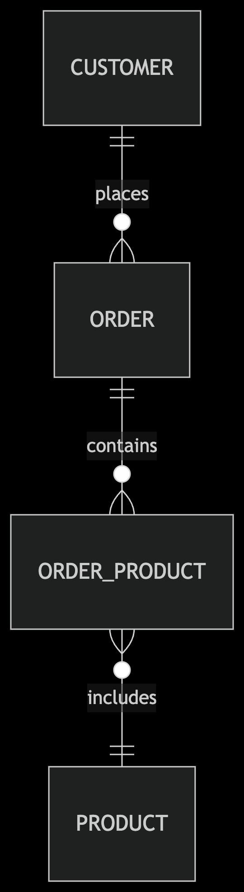

# Express Lab 3: Sequelize Relationships

## 📋 Prereqs:

Make sure the following are already installed and that you have already completed Express Lab 2 (PostgreSQL CRUD):

1.  [PostgreSQL 14+](https://www.postgresql.org/download/)
2.  Node.js
3.  [Postman](https://www.postman.com/downloads/)

```bash
# Verify installations
psql --version
node -v
```

## 🛠️ Setup Instructions

1.  Create PostgreSQL Role (If Missing)

    ```bash
    psql -d template1 -c "CREATE ROLE postgres WITH SUPERUSER LOGIN;"
    ```

2.  Create Database

    ```bash
    createdb ecommerce-lab3
    ```

3.  Clone & Install

    ```bash
    git clone <your-repo-url>
    cd express-lab-03
    npm install
    ```

### Important Documentation

- [Express Routing](https://expressjs.com/en/guide/routing.html)
- [Postman Request](https://learning.postman.com/docs/sending-requests/create-requests/request-basics/)
- [Rest API Concepts](https://www.restapitutorial.com/introduction/httpmethods)
- [Status Codes](https://developer.mozilla.org/en-US/docs/Web/HTTP/Reference/Status)
- [Postgres Numeric Types](https://www.postgresql.org/docs/current/datatype-numeric.html)

## 🛠️ Setup Instructions:

Configure Environment (create **.env** file)

    ```bash
    process.env.PG_HOST=localhost
    process.env.PG_USER=postgres
    process.env.PG_PASSWORD=password
    process.env.PG_DATABASE=ecommerce-lab3
    process.env.PG_PORT=5432
    ```

## 🗄️ Database Structure



## 🚀 Running the Server

1. Development Mode (Auto-restart)

   ```bash
   npm run dev
   ```

   - You should see:

   ```bash
   > nodemon server.js
   [nodemon] starting `node server.js`
   Server running on http://localhost:3000
   ```

## 🎯 Lab Objectives

1. Master Sequelize associations (1:Many, Many:Many).
2. Build REST endpoints that return eager‑loaded related data.
3. Add basic validation & error handling.
4. Inspect results with Postman and psql.

## 📝 Lab Tasks

### Task 1: Understand the Model Relationships

```js
// Customer-Order (1:Many)
Customer.hasMany(Order);
Order.belongsTo(Customer);
// Order-Product (Many:Many)
Order.belongsToMany(Product, { through: "OrderProducts" });
Product.belongsToMany(Order, { through: "OrderProducts" });
```

### Task 2: Order Routes

| Method | URL    | Purpose                                    |
| ------ | ------ | ------------------------------------------ |
| GET    | `/`    | List all orders (with customer + products) |
| GET    | `/:id` | One order (+ calculated **total**)         |
| POST   | `/`    | Create order                               |
| PUT    | `/:id` | Update order (e.g. status)                 |
| DELETE | `/:id` | Remove order                               |

```json
// GET /api/orders         (response)
[
  {
    "id": 1,
    "status": "pending",
    "customer": {
      "id": 2,
      "name": "Tony Stark",
      "email": "tony@starkindustries.com"
    },
    "products": [
      {
        "id": 3,
        "name": "Wireless Mouse",
        "price": 29.99,
        "OrderProducts": { "quantity": 2 }
      }
    ],
    "total": 59.98,
    "createdAt": "2025‑05‑12T01:23:45.000Z"
  }
]

  // POST /api/orders        (request)
{
  "customerId": 2,
  "products": [
    { "id": 3, "qty": 1 },
    { "id": 5, "qty": 2 }
  ]
}


  // 201 Created             (response)
{
  "id": 4,
  "status": "pending",
  "customerId": 2,
  "products": [
    {
      "id": 3,
      "name": "Wireless Mouse",
      "OrderProducts": { "quantity": 1 }
    },
    {
      "id": 5,
      "name": "USB‑C Dock",
      "OrderProducts": { "quantity": 2 }
    }
  ],
  "total": 268.99
}
```

### Task 2: Products API – /api/products

| Method | URL    |
| ------ | ------ |
| GET    | `/`    |
| GET    | `/:id` |
| POST   | `/`    |
| PUT    | `/:id` |
| DELETE | `/:id` |

```json
// GET /api/products
[
  { "id": 3, "name": "Wireless Mouse", "price": 29.99, "stock": 50 },
  { "id": 4, "name": "Mechanical Keyboard", "price": 89.99, "stock": 25 }
]

// POST /api/products      (request)
{ "name": "HDMI Cable", "price": 12.5, "stock": 100 }

// 201 Created             (response)
{ "id": 6, "name": "HDMI Cable", "price": 12.5, "stock": 100 }
```

### Task 3: Customers API – /api/customers

| Method | URL    |
| ------ | ------ |
| GET    | `/`    |
| GET    | `/:id` |
| POST   | `/`    |
| PUT    | `/:id` |
| DELETE | `/:id` |

```json
// GET /api/customers/2
{
  "id": 2,
  "name": "Tony Stark",
  "email": "tony@starkindustries.com",
  "orders": [
    {
      "id": 1,
      "status": "pending",
      "products": [
        {
          "id": 3,
          "name": "Wireless Mouse",
          "OrderProducts": { "quantity": 2 }
        }
      ]
    }
  ]
}
// Email should be unique. Return 409 on duplicate.
```

## 🧪 Postman Testing Guide

Collection Setup

1. Open Postman
2. Create new collection: Postgres Routing Lab
3. Add these requests:
   - **GET** http://localhost:3000/api/orders ( Array resembles sample JSON)
   - **GET** http://localhost:3000/api/orders/999 (404 error JSON)
   - **POST** http://localhost:3000/api/orders (missing fields -- 400 status)
   - **POST** http://localhost:3000/api/products (valid -- status 201)
   - **PUT** http://localhost:3000/api/customers/1 (Updated customer JSON)
   - **DELETE** http://localhost:3000/api/products/1 (204, then GET → 404)
